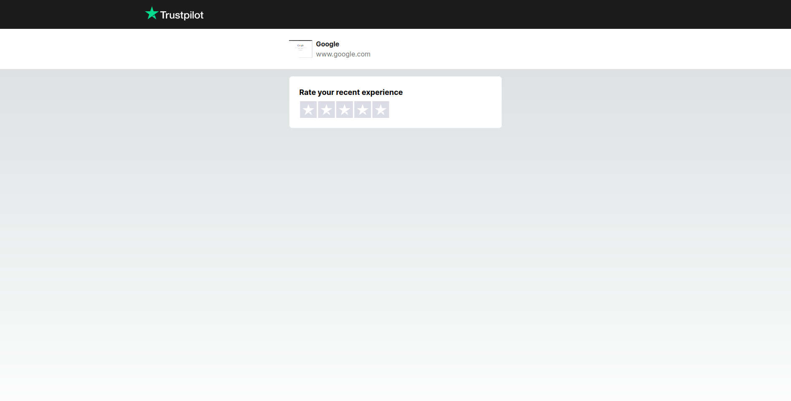
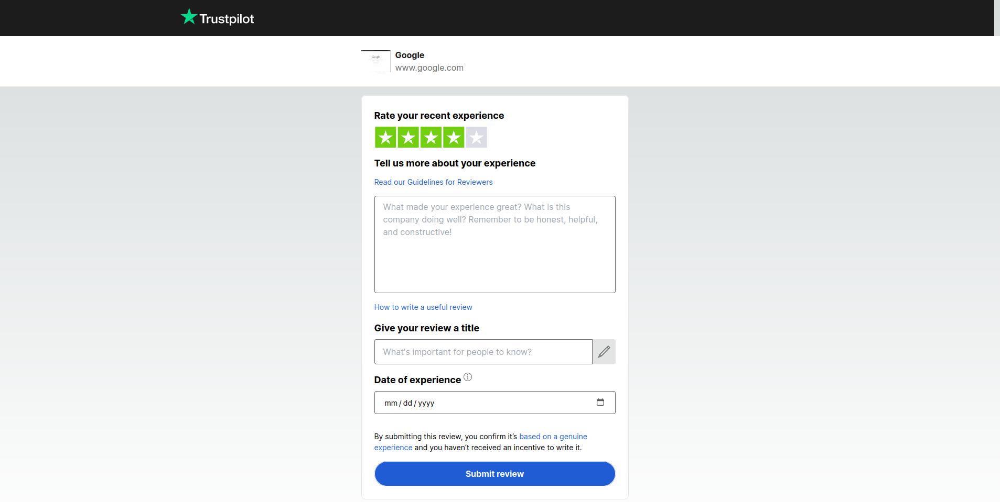

# Trust pilot

<br>

## Demo

A live demo is available [here](https://trust-pilot-bay.vercel.app/).

Example screens:





## Stack

- Nextjs
- TypeScript
- ESLint
- Tailwind CSS
- Jest
- Playwright
- Prisma
- Supabase

<br />

## Installation

Clone the repository:

```
git clone git@github.com:hirondelledemer/react-login.git
```

Install dependencies:

```
npm i
```

<br />

## Development

To start development:

```
npm run dev
```

To run tests:

```
npm run test         // unit tests
npm run test:watch   // unit tests in watch mode
npm run test:e2e     // e2e tests
```

<br />
