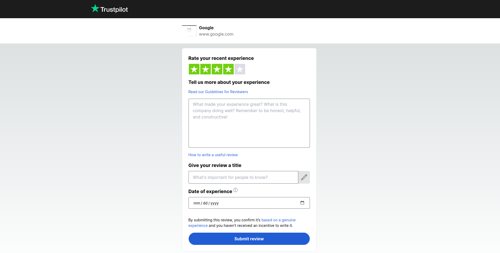

# Trust pilot

<br>

## Description

Trust Pilot Form is an application that recreates the Trust Pilot review form and saves users' reviews in a separate database. Depending on the review rating, the user is either redirected to the actual Trust Pilot page or shown a "success" screen.

- If the review rating is 4 or 5, after submitting the form, the user is redirected to the official Trust Pilot page.

- If the review rating is below 4, the user is shown a "success" screen, indicating their review has been submitted.

<br>

## Demo

A live demo is available [here](https://trust-pilot-bay.vercel.app/).

Example screens:




## Stack

- Next.js
- TypeScript
- ESLint
- Tailwind CSS
- Jest
- Playwright
- Prisma
- Supabase

<br />

## Installation

Clone the repository:

```
git clone git@github.com:hirondelledemer/trust-pilot.git
```

Install dependencies:

```
npm i
```

<br />

## Development

To start development:

```
npm run dev
```

To lint:

```
npm run lint
```

To run tests:

```
npm run test         // unit tests
npm run test:watch   // unit tests in watch mode
npm run test:e2e     // e2e tests
```

<br />
